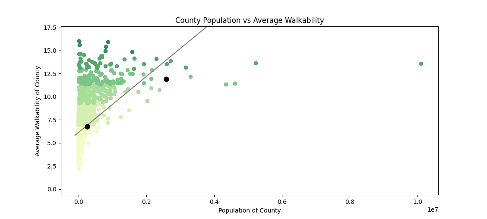

# Walkability Comparison: Kalamazoo vs. Dallas County

**Objective:**  
I practice data analysis by comparing the **Walkability** between **Kalamazoo** and **Dallas County** using Python and ArcGIS.

---

## Data Set Used:
[Walkability Index Data Set](https://catalog.data.gov/dataset/walkability-index1)

---

## Findings:  
The PDF titled **"Comparison of Kalamazoo and Dallas County Walkability"** contains some of the key insights and results from working with this data set.

